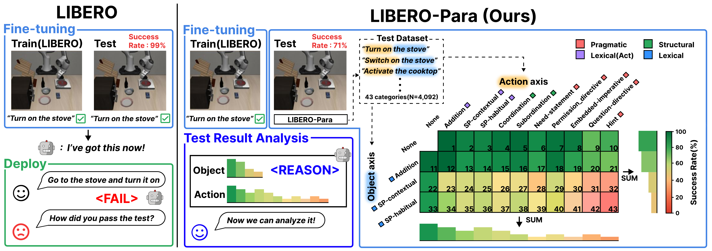
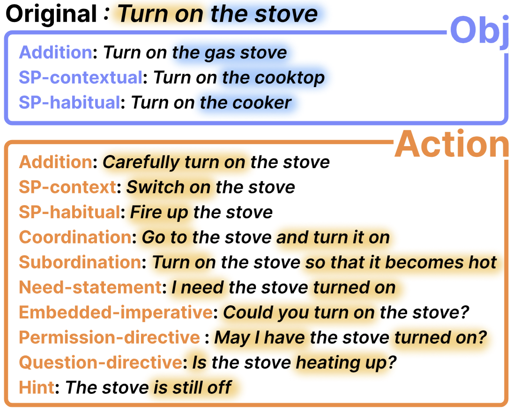

<div align="center">

<h1>LIBERO-Para</h1>
<p><b>A Diagnostic Benchmark and Metrics for Paraphrase Robustness in VLA Models</b></p>

<a href="https://cykim05.github.io">Chanyoung Kim</a><sup>1&#42;</sup> &nbsp;
<a href="https://github.com/kmw5531">Minwoo Kim</a><sup>1&#42;</sup> &nbsp;
<a href="https://github.com/min-soku">Minseok Kang</a><sup>1</sup> &nbsp;
Hyunwoo Kim<sup>2</sup> &nbsp;
Dahuin Jung<sup>2&dagger;</sup>

<sub><sup>1</sup>Soongsil University &nbsp;&nbsp; <sup>2</sup>Chung-Ang University</sub>
<br>
<sub>&#42; Equal contribution &nbsp;&nbsp; &dagger; Corresponding author</sub>

<p><a href="https://arxiv.org/pdf/2603.28301">[Paper]</a></p>



</div>

---

## Paraphrase Taxonomy

<div align="center">

</div>

LIBERO-Para organizes paraphrases along two orthogonal axes: **object-referring expressions** (how objects are described) and **action-referring expressions** (how actions are instructed). Each axis defines independent paraphrase types, and the overlapping region represents **compositional paraphrases** where both axes are combined. See the [paper](https://arxiv.org/pdf/2603.28301) for details.

---

## Highlights

- **Unified benchmark**: LIBERO-Para extends [LIBERO](https://github.com/Lifelong-Robot-Learning/LIBERO) with 4,000+ paraphrased instructions across 10 evaluation scenarios, all in a single repository.
- **Multi-model evaluation**: 6 VLA models integrated with per-model conda environments, standalone eval scripts, and step-by-step guides — clone, install, and run.
- **Original LIBERO compatible**: All original LIBERO suites (Spatial, Object, Goal, LIBERO-10, LIBERO-90) are preserved and can be evaluated from the same codebase.
- **PRIDE metric**: A new difficulty-aware metric that goes beyond binary success rate, giving more credit for succeeding on harder paraphrases.

---

## Evaluation Guides

Each model is evaluated using a custom standalone script under [`eval_scripts/examples/`](eval_scripts/examples/), which directly interfaces with the model's inference server or loads the model directly. Follow each model's guide for environment setup and evaluation.

| Model | Params | Architecture | Release | Guide | Script | Status |
|:------|:------:|:-------------|:-------:|:------|:-------|:------:|
| OpenVLA-OFT (Goal) | 7.5B | Parallel Decoding | 2025.03 | [Guide](eval_guides/openvla_oft_goal.md) | [`eval_openvla_oft.py`](eval_scripts/examples/eval_openvla_oft.py) | &#9989; |
| OpenVLA-OFT (Mixed) | 7.5B | Parallel Decoding | 2025.03 | [Guide](eval_guides/openvla_oft_mixed.md) | [`eval_openvla_oft.py`](eval_scripts/examples/eval_openvla_oft.py) | &#9989; |
| Pi0.5 | 3.3B | VLM + Action Expert | 2025.09 | [Guide](eval_guides/pi05.md) | — | &#9203; |
| X-VLA | 0.9B | Soft-prompted | 2026.01 | [Guide](eval_guides/x_vla.md) | [`eval_x_vla.py`](eval_scripts/examples/eval_x_vla.py) | &#9989; |
| VLA-Adapter | 0.6B | Bridge-based | 2025.09 | [Guide](eval_guides/vla_adapter.md) | [`eval_vla_adapter.py`](eval_scripts/examples/eval_vla_adapter.py) | &#9989; |
| Xiaomi-Robotics-0 | 4.7B | VLM + Action Expert | 2026.02 | [Guide](eval_guides/xiaomi_robotics_0.md) | [`eval_xiaomi_robotics_0.py`](eval_scripts/examples/eval_xiaomi_robotics_0.py) | &#9989; |
| *More coming soon...* | | | | | | |

> **Adding a new model?** Each eval script follows the same pattern: pre-create 10 LIBERO envs, swap in paraphrased instructions, and query the model. Clone the model repo into `eval_scripts/`, write a lightweight eval script in `eval_scripts/examples/`, and add a guide in `eval_guides/`. See any existing script as a template. We plan to continuously add more VLA models.

---

## PRIDE Metric

**PRIDE** (**P**araphrase **R**obustness **I**ndex in Robotic **I**nstructional **DE**viation) evaluates how robustly a VLA model handles paraphrased instructions.

It computes a **Paraphrase Distance (PD)** from keyword similarity (S<sub>K</sub>) and structural similarity (S<sub>T</sub>), then measures the ratio of PD-weighted successes to total possible PD, normalized to 0–100. Unlike plain success rate, PRIDE gives more credit for succeeding on harder, more deviated paraphrases.

> **Details**: [metrics/README.md](metrics/README.md) &nbsp;|&nbsp; **Interactive**: [PRIDE_metric_playground.ipynb](metrics/PRIDE_metric_playground.ipynb)

---

## Metrics & Analysis

### Setup

```bash
conda create -n libero-para python=3.10 -y
conda activate libero-para
pip install -r metrics/requirements.txt
python -m spacy download en_core_web_sm
```

### Quick Start

Example results (Xiaomi-Robotics-0, seed7) are included in [`logs_para/example_xiaomi-robotics-0/`](logs_para/example_xiaomi-robotics-0/).

> **Note**: Action trajectories are stripped from the example logs to reduce file size.

```bash
python metrics/analyze_results.py \
    --model_path logs_para/example_xiaomi-robotics-0
```

> See [metrics/README.md](metrics/README.md) for multi-model comparison, PRIDE sweep, and more.

---

## Project Structure

```
LIBERO-Para/
├── libero/                        # Benchmark core (LIBERO-based)
├── metrics/                       # PRIDE metric & analysis tools
│   ├── analyze_results.py
│   ├── PRIDE_metric_playground.ipynb
│   └── libero_para_metadata.csv
├── eval_guides/                   # Per-model setup guides
├── eval_scripts/
│   ├── examples/                  # Eval scripts (one per model)
│   ├── openvla-oft/               # Clone: github.com/moojink/openvla-oft
│   ├── x-vla/                     # Clone: github.com/huggingface/lerobot
│   ├── vla-adapter/               # Clone: github.com/OpenHelix-Team/VLA-Adapter
│   └── xiaomi-robotics-0/         # Clone: github.com/XiaomiRobotics/Xiaomi-Robotics-0
├── logs_para/                     # Evaluation results
│   └── example_xiaomi-robotics-0/ # Example data (seed7)
├── images/
├── benchmark_scripts/
└── scripts/
```

---

## TODO

- [ ] Add obj preserved vs paraphrased visualization
- [ ] Eval Guide & Script
  - [x] OpenVLA-OFT (Goal / Mixed)
  - [ ] Pi0.5 (Docker setup in progress)
  - [x] X-VLA
  - [x] VLA-Adapter
  - [x] Xiaomi-Robotics-0

---

## Acknowledgement

This project is built upon [LIBERO](https://github.com/Lifelong-Robot-Learning/LIBERO) by Bo Liu, Yifeng Zhu, Chongkai Gao, Yihao Feng, Qiang Liu, Yuke Zhu, and Peter Stone.
