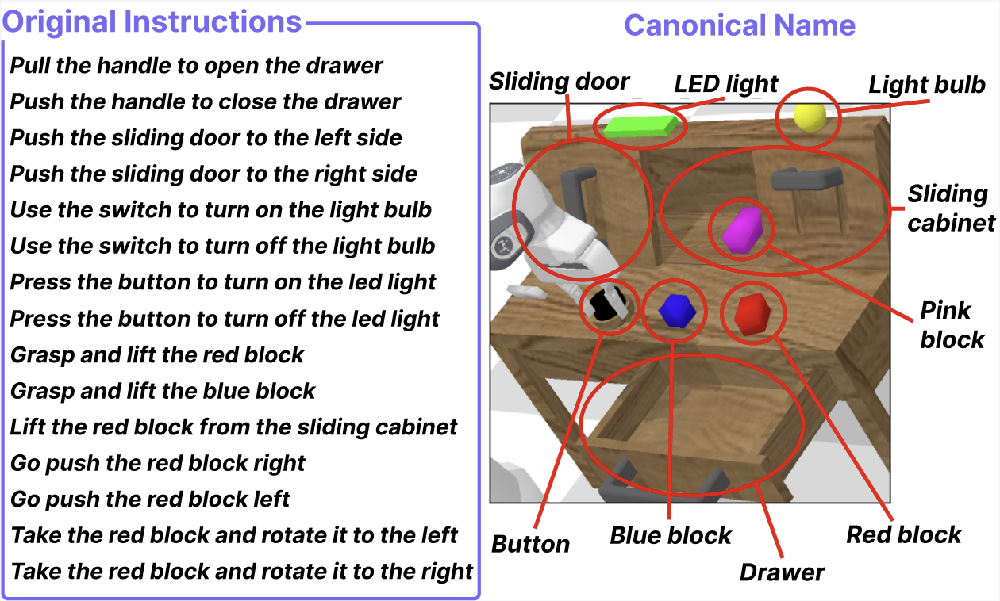

<div align="center">

# CALVIN-Para

**Paraphrase-robustness benchmark for CALVIN, for cross-benchmark transferability tests of PRIDE**

<p>
<a href="https://huggingface.co/datasets/HAI-Lab/CALVIN-Para"></a>
<a href="https://arxiv.org/pdf/2603.28301"></a>
</p>



</div>

---

## Overview

CALVIN-Para ports the [LIBERO-Para](../) paraphrase taxonomy, 4 object axes × 11 action
axes for 43 cells in total, onto [CALVIN](https://github.com/mees/calvin). The question it
answers is whether paraphrase brittleness is a property of one benchmark or of VLA models
in general.

**1,935 paraphrased instructions** = 15 CALVIN tasks × 43 cells × 3 paraphrases each.

All 15 tasks share one scene (CALVIN scene D). Every canonical name above is present in
every episode: drawer, sliding door, sliding cabinet, button, LED light, light bulb, and the
red, blue, and pink blocks. Renaming an object therefore forces real disambiguation against
on-screen distractors rather than a free pass.

---

## Highlights

- **Cross-benchmark validation**: the same 43-cell taxonomy and the same PRIDE metric as LIBERO-Para, applied to a different simulator, robot, and task family.
- **Controlled pairing**: each paraphrase episode reuses a baseline episode's initial state, so a canonical run and its paraphrased counterpart differ only in language.
- **Per-episode trajectory logging**: every episode records per-step actions and end-effector positions, not just a success bit, which makes failure-mode analysis possible rather than pass/fail counting.
- **Cluster-aware failure taxonomy**: failures are separated into "nearly succeeded", "executed a different task", and "wandered off", using per-cluster trajectory envelopes that handle CALVIN's multi-modal block placements.
- **Non-invasive integration**: each model repo is cloned upstream and carries a small patch adding a per-episode eval path, so there are no forks to maintain.

---

## Evaluation Guides

Each model is evaluated through its own upstream repo plus a patch that adds a per-episode
eval path (`EPISODES_JSON`), which replaces CALVIN's 5-task long-horizon rollout with one
initial state and one instruction per episode. Follow each model's guide for environment
setup, weights, and evaluation.

| Model | Params | Architecture | Release | Guide | Weights |
|:------|:------:|:-------------|:-------:|:------|:--------|
| FLOWER | 1B | Flow matching + Florence-2 | 2025.03 | [Guide](eval_guides/flower.md) | [mbreuss/flower_calvin_abcd](https://huggingface.co/mbreuss/flower_calvin_abcd) |
| RoboFlamingo | 3B | OpenFlamingo + LSTM head | 2023.11 | [Guide](eval_guides/roboflamingo.md) | [robovlms/RoboFlamingo](https://huggingface.co/robovlms/RoboFlamingo) |
| *More coming soon...* | | | | | |

> **Adding a new model?** Each integration needs a per-episode eval path, a runner script, and a guide. See [eval_guides/README.md](eval_guides/README.md).

---

## Task Selection

CALVIN defines 34 tasks; CALVIN-Para uses 15, after two filters.

**34 → 20: drop pure color variants.** `rotate`, `push`, and `lift` exist for red, blue,
and pink blocks. Keeping all three would dilute the object axis, which is the whole point of
the experiment, without adding a single new skill. We keep red throughout, plus
`lift_blue_block_table` for a second color.

**20 → 15: drop tasks that cannot start a sequence.** CALVIN generates initial states only
for the *first* task of a rollout, so tasks needing prior manipulation have no reachable
initial state. `check_singletask_feasibility.py` samples 20k sequences and counts first-slot
occurrences; these five never appear:

| dropped | why |
|---|---|
| `lift_red_block_drawer` | block must already be in the drawer |
| `place_in_slider` | gripper must already hold a block |
| `place_in_drawer` | same |
| `stack_block` | same |
| `unstack_block` | blocks must already be stacked |

The remaining 15 are 8 static (drawer / slider / lightbulb / LED) and 7 dynamic (block
manipulation). Each pins exactly one precondition and randomizes the other six state
variables: `open_drawer` needs a closed drawer, `lift_red_block_table` needs the red block on
the table. Blocks sit on the table or inside the sliding cabinet per episode, so the number
of *visible* distractors varies while the object set never does.

> **Known limitation**: the surviving tasks are red-block-centric. `lift_blue_block_table`
> is the only non-red block target, and pink is never a target. Object-axis conclusions
> should be read with that in mind.

---

## Failure Taxonomy

Success rate alone cannot distinguish "almost did it" from "did something else entirely".
Because every episode logs its full end-effector trajectory, each failure can be classified
by comparing that trajectory (DTW over a 50-point resample) against per-task envelopes built
from canonical successes:

- **NearGT**: inside the canonical task's envelope, so the model nearly succeeded
- **Cross-NearGT**: inside *another* task's envelope, so the model executed the wrong task
- **FarGT-Unmatched**: inside no envelope, so the model wandered off

Block tasks have bimodal initial block positions (left / right), so a single envelope per
task comes out artificially wide and swallows genuine wander-offs. `compute_neargt_fargt_v2.py`
clusters canonical successes by grasp xy, using K=2 for dynamic tasks and K=1 for static,
then gives each cluster its own envelope. That is what makes the NearGT category meaningful.

The distinction matters here because the 15 tasks overlap: from a typical initial state,
about half of them are simultaneously feasible, so a model that misreads an instruction has
plenty of valid alternatives to drift into.

---

## Results & Analysis

### Setup

```bash
conda create -n calvin-para-analysis python=3.10 -y
conda activate calvin-para-analysis
pip install -r ../metrics/requirements.txt
python -m spacy download en_core_web_sm
```

### Quick Start

Per-model tables are in [`RESULTS/`](RESULTS/): headline metrics, per-task success rates,
and the 43-cell breakdown. Figures are not committed, so regenerate them from the same data:

```bash
# 4x11 obj x act success-rate heatmaps (LIBERO-Para style)
python paraphrase_eval/analysis/libero_style_heatmap.py

# cluster-aware failure taxonomy
python paraphrase_eval/analysis/compute_neargt_fargt_v2.py --model flower

# per-cell tables + failure-mode heatmaps
python paraphrase_eval/analysis/paraphrase_table.py --model flower \
    --neargt_cache paraphrase_eval/analysis/cache/flower__neargt_fargt_v2.json

# headline summary incl. PRIDE
python paraphrase_eval/analysis/model_summary.py flower

# rendered scene figures (needs the CALVIN env, not this one)
python paraphrase_eval/analysis/render_scene.py
```

> See [RESULTS/README.md](RESULTS/README.md) for the numbers and what each file contains.

---

## Project Structure

```
calvin-para/
├── calvin/                     # Clone: github.com/mees/calvin
├── flower_vla_calvin/          # Clone: github.com/intuitive-robots/flower_vla_calvin
├── RoboFlamingo/               # Clone: github.com/RoboFlamingo/RoboFlamingo
├── patches/                    # Per-episode eval patches for the two model repos
├── checkpoints/                # Downloaded weights (see eval_guides/)
├── eval_guides/                # Per-model setup guides
├── paraphrase_eval/
│   ├── build_episodes.py       # paraphrases.json -> episode JSONs
│   ├── run_*_episodes.sh       # Per-model runners
│   ├── episodes/               # Baseline + paraphrase episode definitions
│   ├── results/                # Per-episode eval output
│   └── analysis/               # Failure taxonomy, tables, scene rendering
└── RESULTS/                    # Metrics and per-cell tables
```

Paraphrase generation lives in a [sibling directory](../paraphrase_generation/) shared
with LIBERO-Para.

---

## Acknowledgement

Built on [CALVIN](https://github.com/mees/calvin) by Oier Mees, Lukas Hermann, Erick
Rosete-Beas, and Wolfram Burgard. Evaluated models: [FLOWER](https://github.com/intuitive-robots/flower_vla_calvin)
and [RoboFlamingo](https://github.com/RoboFlamingo/RoboFlamingo).
